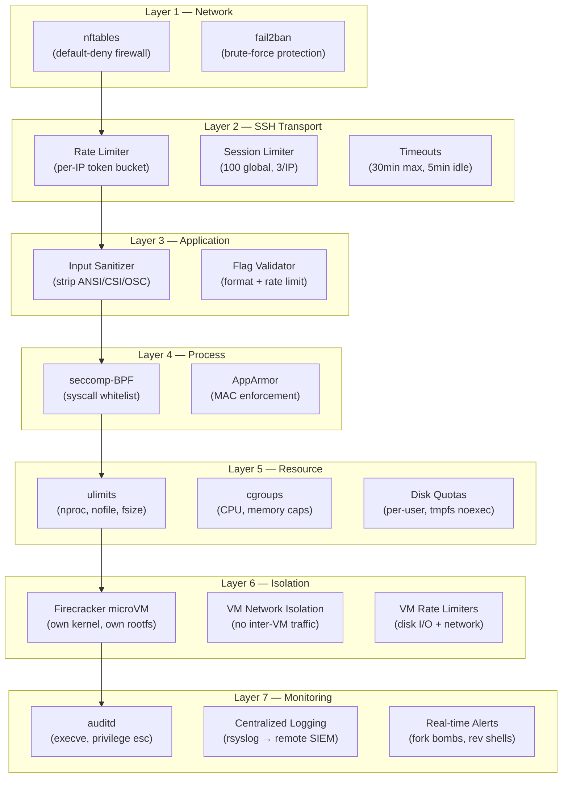
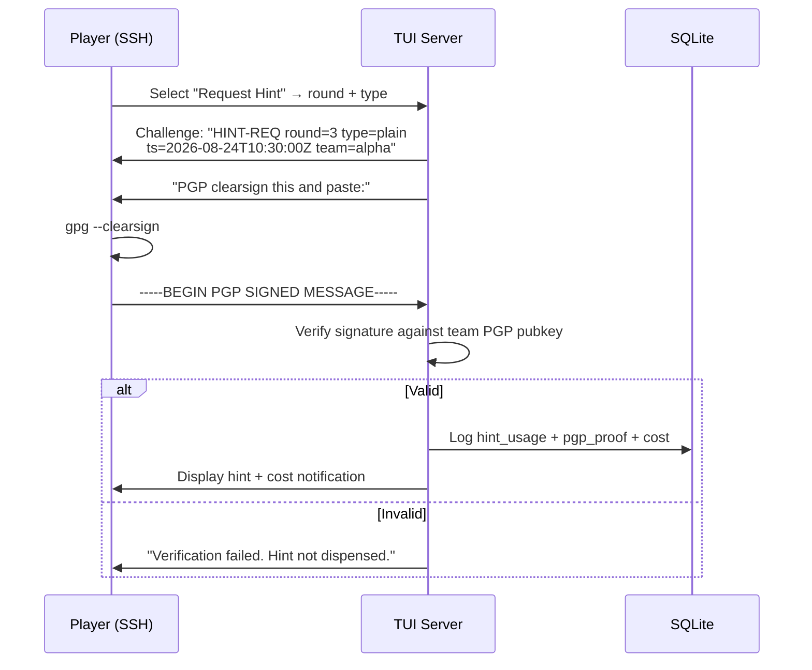
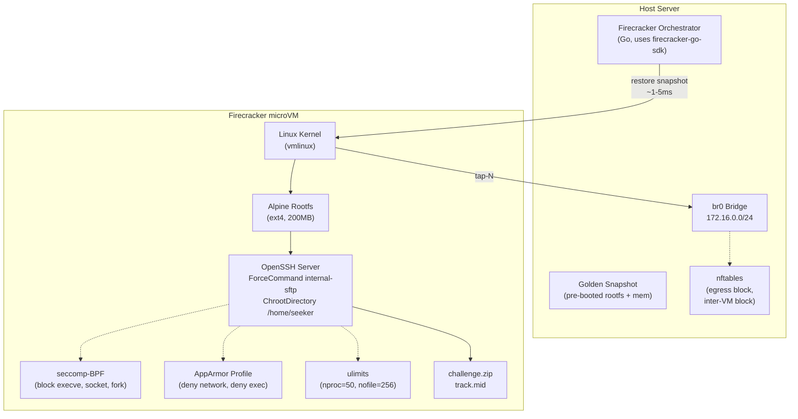

# IEEE CTF Event — Platform Implementation Plan

## Goal

Design and document the two server-side platforms required for the IEEE CTF event, with **Firecracker microVM isolation** and **defense-in-depth security** against all classes of attacks:

1. **Submission Portal TUI** — Scoring engine over SSH via Bubble Tea, hardened with 7 security layers
2. **Challenge File SSH Server** — Serves files inside a Firecracker microVM with locked-down shell

---

## Security Architecture Overview



---

## CTF Scoring Rules

| Action | Cost |
|--------|------|
| Clear a round | +`round_points` (configurable per round) |
| Skip a round | −50% of your **current total** points |
| Plain English hint | −20% of the **round's** points per hint |
| Encoded hint (CTF decode required) | −10% of the **round's** points per hint |
| Minimum score | **Unbounded negative** |

> [!IMPORTANT]
> Hint requests require **PGP clearsigning** a challenge string with the team's registered key. This prevents accidental consumption and provides non-repudiation.

---

## Platform 1: Submission Portal TUI

### Tech Stack

| Component | Technology | Version |
|-----------|-----------|---------|
| Language | Go | 1.22+ |
| TUI Framework | `github.com/charmbracelet/bubbletea` | v1.x |
| TUI Components | `github.com/charmbracelet/bubbles` | v0.20+ |
| Styling | `github.com/charmbracelet/lipgloss` | v1.x |
| SSH Server | `github.com/charmbracelet/wish` | v1.4+ |
| Forms | `github.com/charmbracelet/huh` | v0.6+ |
| Database | `modernc.org/sqlite` (pure Go, no CGO) | latest |
| PGP | `github.com/ProtonMail/go-crypto` | latest |
| Rate Limiter | `golang.org/x/time/rate` | latest |

### Directory Structure

```
submission-portal/
├── cmd/
│   ├── server/
│   │   └── main.go                  # Entry: Wish SSH server with security middleware
│   └── admin/
│       └── main.go                  # Admin CLI (team mgmt, scoring, DB ops)
├── internal/
│   ├── server/
│   │   ├── server.go                # Wish server setup + middleware chain
│   │   └── config.go                # Config loading (port, host key, DB path, limits)
│   ├── auth/
│   │   ├── auth.go                  # SSH password verification (bcrypt)
│   │   └── pgp.go                   # PGP signature verification for hints
│   ├── middleware/
│   │   ├── ratelimit.go             # Per-IP token bucket rate limiter
│   │   ├── sessions.go              # Concurrent session limiter (global + per-IP)
│   │   ├── timeout.go               # Max session duration + idle timeout
│   │   └── sanitize.go              # Input sanitization + ANSI escape stripping
│   ├── tui/
│   │   ├── root.go                  # Root model (view state machine / router)
│   │   ├── styles.go                # Lipgloss styles
│   │   ├── views/
│   │   │   ├── welcome.go           # ASCII banner + welcome screen
│   │   │   ├── register.go          # First-login: set password + paste PGP pubkey
│   │   │   ├── dashboard.go         # Main menu: submit, hints, scoreboard, skip
│   │   │   ├── submit_flag.go       # Round selector + flag input
│   │   │   ├── request_hint.go      # PGP challenge → hint display
│   │   │   ├── skip_round.go        # Skip confirmation (shows penalty)
│   │   │   ├── scoreboard.go        # Live leaderboard table
│   │   │   └── team_status.go       # Per-team progress + points breakdown
│   │   └── components/
│   │       ├── header.go            # Reusable banner
│   │       ├── footer.go            # Keybind help bar
│   │       ├── notification.go      # Flash messages (success/error)
│   │       └── confirm.go           # Yes/No confirmation dialog
│   ├── scoring/
│   │   ├── engine.go                # Core scoring logic
│   │   ├── hints.go                 # Hint cost calculation
│   │   └── validator.go             # Flag format validation + submission rate limit
│   ├── store/
│   │   ├── db.go                    # SQLite connection + migration runner + WAL mode
│   │   ├── teams.go                 # Team CRUD
│   │   ├── submissions.go           # Submission logging + duplicate guard
│   │   ├── hints.go                 # Hint usage tracking
│   │   └── rounds.go               # Round config + point values
│   └── models/
│       └── types.go                 # Shared types
├── migrations/
│   └── 001_initial.sql
├── configs/
│   ├── rounds.yaml                  # Round definitions (id, name, points, flag_hash, hints)
│   └── server.yaml                  # Server config + security tuning
├── .ssh/
│   └── id_ed25519
├── go.mod
├── go.sum
├── Dockerfile
└── README.md
```

---

### Database Schema

```sql
-- migrations/001_initial.sql

PRAGMA journal_mode=WAL;
PRAGMA busy_timeout=5000;

CREATE TABLE teams (
    id          INTEGER PRIMARY KEY AUTOINCREMENT,
    name        TEXT    UNIQUE NOT NULL,
    ssh_user    TEXT    UNIQUE NOT NULL,
    ssh_pass    TEXT    NOT NULL,           -- bcrypt hash
    pgp_pubkey  TEXT    NOT NULL DEFAULT '',
    registered  BOOLEAN DEFAULT 0,
    created_at  DATETIME DEFAULT CURRENT_TIMESTAMP
);

CREATE TABLE rounds (
    id          INTEGER PRIMARY KEY,
    name        TEXT    NOT NULL,
    points      INTEGER NOT NULL,
    flag_hash   TEXT    NOT NULL,           -- SHA-256 of correct flag
    is_active   BOOLEAN DEFAULT 1,
    sort_order  INTEGER NOT NULL
);

CREATE TABLE submissions (
    id           INTEGER PRIMARY KEY AUTOINCREMENT,
    team_id      INTEGER NOT NULL REFERENCES teams(id),
    round_id     INTEGER NOT NULL REFERENCES rounds(id),
    flag_input   TEXT    NOT NULL,
    is_correct   BOOLEAN NOT NULL,
    submitted_at DATETIME DEFAULT CURRENT_TIMESTAMP
);

CREATE UNIQUE INDEX idx_correct_once
    ON submissions(team_id, round_id) WHERE is_correct = 1;

CREATE TABLE hint_usage (
    id          INTEGER PRIMARY KEY AUTOINCREMENT,
    team_id     INTEGER NOT NULL REFERENCES teams(id),
    round_id    INTEGER NOT NULL REFERENCES rounds(id),
    hint_type   TEXT    NOT NULL CHECK(hint_type IN ('plain', 'encoded')),
    hint_index  INTEGER NOT NULL,
    pgp_proof   TEXT    NOT NULL,
    cost_points REAL    NOT NULL,
    used_at     DATETIME DEFAULT CURRENT_TIMESTAMP
);

CREATE TABLE skips (
    id          INTEGER PRIMARY KEY AUTOINCREMENT,
    team_id     INTEGER NOT NULL REFERENCES teams(id),
    round_id    INTEGER NOT NULL REFERENCES rounds(id),
    cost_points REAL    NOT NULL,
    skipped_at  DATETIME DEFAULT CURRENT_TIMESTAMP,
    UNIQUE(team_id, round_id)
);

CREATE VIEW scoreboard AS
SELECT
    t.id   AS team_id,
    t.name AS team_name,
    COALESCE(SUM(CASE WHEN s.is_correct THEN r.points ELSE 0 END), 0)
      - COALESCE((SELECT SUM(cost_points) FROM hint_usage WHERE team_id = t.id), 0)
      - COALESCE((SELECT SUM(cost_points) FROM skips      WHERE team_id = t.id), 0)
      AS total_score,
    COUNT(DISTINCT CASE WHEN s.is_correct THEN s.round_id END) AS rounds_solved
FROM teams t
LEFT JOIN submissions s ON s.team_id = t.id
LEFT JOIN rounds r      ON r.id = s.round_id
GROUP BY t.id
ORDER BY total_score DESC;
```

---

### Server Config

```yaml
# configs/server.yaml
server:
  host: "0.0.0.0"
  port: "2222"
  host_key_path: ".ssh/id_ed25519"

database:
  path: "ctf.db"

security:
  rate_limit:
    requests_per_second: 1.0       # per-IP rate
    burst: 5                        # burst allowance
  sessions:
    max_global: 100
    max_per_ip: 3
  timeouts:
    max_session_minutes: 30
    idle_timeout_minutes: 5
  submissions:
    per_minute_per_team: 2          # flag submissions rate limit
    cooldown_seconds: 30
  input:
    max_flag_length: 256
    max_pgp_message_length: 8192
    max_team_name_length: 32
```

---

### Wish SSH Server with Security Middleware

```go
// cmd/server/main.go

package main

import (
    "context"
    "log"
    "os"
    "os/signal"
    "syscall"
    "time"

    tea "github.com/charmbracelet/bubbletea"
    "github.com/charmbracelet/ssh"
    "github.com/charmbracelet/wish"
    "github.com/charmbracelet/wish/activeterm"
    bm "github.com/charmbracelet/wish/bubbletea"
    lm "github.com/charmbracelet/wish/logging"
    "golang.org/x/time/rate"

    "ieee-ctf/internal/auth"
    mw "ieee-ctf/internal/middleware"
    "ieee-ctf/internal/store"
    "ieee-ctf/internal/tui"
)

func main() {
    cfg := loadConfig("configs/server.yaml")
    db := store.MustOpen(cfg.Database.Path)
    defer db.Close()

    s, err := wish.NewServer(
        wish.WithAddress(cfg.Server.Host+":"+cfg.Server.Port),
        wish.WithHostKeyPath(cfg.Server.HostKeyPath),

        // SSH authentication
        wish.WithPasswordAuth(func(ctx ssh.Context, password string) bool {
            return auth.VerifyTeamLogin(db, ctx.User(), password)
        }),

        // Middleware chain (outermost → innermost)
        wish.WithMiddleware(
            mw.RateLimitMiddleware(                         // Layer 2: rate limit
                rate.Limit(cfg.Security.RateLimit.RequestsPerSecond),
                cfg.Security.RateLimit.Burst,
            ),
            mw.MaxSessionsMiddleware(                       // Layer 2: session cap
                int32(cfg.Security.Sessions.MaxGlobal),
                cfg.Security.Sessions.MaxPerIP,
            ),
            mw.TimeoutMiddleware(                           // Layer 2: timeout
                time.Duration(cfg.Security.Timeouts.MaxSessionMinutes)*time.Minute,
                time.Duration(cfg.Security.Timeouts.IdleTimeoutMinutes)*time.Minute,
            ),
            bm.Middleware(func(s ssh.Session) (tea.Model, []tea.ProgramOption) {
                pty, _, _ := s.Pty()
                team, _ := store.GetTeamBySSHUser(db, s.User())
                return tui.NewRootModel(db, team, pty.Window.Width, pty.Window.Height),
                    []tea.ProgramOption{tea.WithAltScreen()}
            }),
            activeterm.Middleware(),
            lm.Middleware(),
        ),
    )
    if err != nil {
        log.Fatalf("Failed to create server: %v", err)
    }

    done := make(chan os.Signal, 1)
    signal.Notify(done, os.Interrupt, syscall.SIGTERM)

    go func() {
        log.Printf("Submission Portal listening on %s:%s", cfg.Server.Host, cfg.Server.Port)
        if err := s.ListenAndServe(); err != nil {
            log.Fatal(err)
        }
    }()

    <-done
    log.Println("Shutting down...")
    ctx, cancel := context.WithTimeout(context.Background(), 30*time.Second)
    defer cancel()
    s.Shutdown(ctx)
}
```

---

### Security Middleware Implementations

#### Rate Limiter (per-IP token bucket)

```go
// internal/middleware/ratelimit.go

package middleware

import (
    "net"
    "sync"
    "time"

    "github.com/charmbracelet/ssh"
    "github.com/charmbracelet/wish"
    "golang.org/x/time/rate"
)

type visitor struct {
    limiter  *rate.Limiter
    lastSeen time.Time
}

func RateLimitMiddleware(r rate.Limit, burst int) wish.Middleware {
    var (
        visitors = make(map[string]*visitor)
        mu       sync.Mutex
    )

    // Evict stale entries every minute
    go func() {
        for {
            time.Sleep(time.Minute)
            mu.Lock()
            for ip, v := range visitors {
                if time.Since(v.lastSeen) > 3*time.Minute {
                    delete(visitors, ip)
                }
            }
            mu.Unlock()
        }
    }()

    return func(next ssh.Handler) ssh.Handler {
        return func(sess ssh.Session) {
            ip, _, _ := net.SplitHostPort(sess.RemoteAddr().String())

            mu.Lock()
            v, exists := visitors[ip]
            if !exists {
                v = &visitor{limiter: rate.NewLimiter(r, burst)}
                visitors[ip] = v
            }
            v.lastSeen = time.Now()
            mu.Unlock()

            if !v.limiter.Allow() {
                wish.Fatalln(sess, "Rate limit exceeded. Try again later.")
                return
            }
            next(sess)
        }
    }
}
```

#### Concurrent Session Limiter

```go
// internal/middleware/sessions.go

package middleware

import (
    "net"
    "sync"
    "sync/atomic"

    "github.com/charmbracelet/ssh"
    "github.com/charmbracelet/wish"
)

func MaxSessionsMiddleware(maxGlobal int32, maxPerIP int) wish.Middleware {
    var (
        globalCount int32
        perIP       = make(map[string]int)
        mu          sync.Mutex
    )

    return func(next ssh.Handler) ssh.Handler {
        return func(sess ssh.Session) {
            ip, _, _ := net.SplitHostPort(sess.RemoteAddr().String())

            if atomic.LoadInt32(&globalCount) >= maxGlobal {
                wish.Fatalln(sess, "Server at maximum capacity.")
                return
            }

            mu.Lock()
            if perIP[ip] >= maxPerIP {
                mu.Unlock()
                wish.Fatalln(sess, "Too many sessions from your IP.")
                return
            }
            perIP[ip]++
            mu.Unlock()
            atomic.AddInt32(&globalCount, 1)

            defer func() {
                atomic.AddInt32(&globalCount, -1)
                mu.Lock()
                perIP[ip]--
                if perIP[ip] <= 0 {
                    delete(perIP, ip)
                }
                mu.Unlock()
            }()

            next(sess)
        }
    }
}
```

#### Timeout Middleware

```go
// internal/middleware/timeout.go

package middleware

import (
    "context"
    "time"

    "github.com/charmbracelet/ssh"
    "github.com/charmbracelet/wish"
)

func TimeoutMiddleware(maxDuration, idleTimeout time.Duration) wish.Middleware {
    return func(next ssh.Handler) ssh.Handler {
        return func(sess ssh.Session) {
            ctx, cancel := context.WithTimeout(sess.Context(), maxDuration)
            defer cancel()

            done := make(chan struct{})
            go func() {
                select {
                case <-ctx.Done():
                    wish.Fatalln(sess, "\nSession timed out. Reconnect to continue.")
                    sess.Close()
                case <-done:
                    return
                }
            }()

            defer close(done)
            next(sess)
        }
    }
}
```

#### Input Sanitizer

```go
// internal/middleware/sanitize.go

package middleware

import (
    "regexp"
    "strings"
    "unicode"
)

// Strip ALL ANSI/CSI/OSC/DCS escape sequences
var ansiRegex = regexp.MustCompile(
    `\x1b\[[0-9;]*[a-zA-Z]` +        // CSI sequences
    `|\x1b\].*?\x07` +                // OSC sequences
    `|\x1bP.*?\x1b\\` +               // DCS sequences
    `|\x1b\[[0-9;]*[~@$^&]`,          // Extended CSI
)

func StripANSI(input string) string {
    return ansiRegex.ReplaceAllString(input, "")
}

func SanitizeInput(input string) string {
    return strings.Map(func(r rune) rune {
        if r == '\n' || r == '\r' || r == '\t' {
            return r
        }
        if unicode.IsControl(r) {
            return -1
        }
        return r
    }, input)
}

func ValidateTextInput(input string, maxLen int) (string, bool) {
    sanitized := SanitizeInput(StripANSI(input))
    if len(sanitized) > maxLen {
        return "", false
    }
    // Block shell metacharacters
    if strings.ContainsAny(sanitized, "`$(){}[]|;&><") {
        return "", false
    }
    return sanitized, true
}
```

---

### TUI State Machine

```go
// internal/tui/root.go

type viewState int

const (
    viewWelcome viewState = iota
    viewRegister
    viewDashboard
    viewSubmitFlag
    viewRequestHint
    viewSkipRound
    viewScoreboard
    viewTeamStatus
)

type RootModel struct {
    state        viewState
    db           *store.DB
    team         *models.Team
    width, height int

    welcome      welcomeModel
    register     registerModel
    dashboard    dashboardModel
    submitFlag   submitFlagModel
    requestHint  requestHintModel
    skipRound    skipRoundModel
    scoreboard   scoreboardModel
    teamStatus   teamStatusModel
    notification notificationModel
}

func (m RootModel) Update(msg tea.Msg) (tea.Model, tea.Cmd) {
    switch msg := msg.(type) {
    case tea.WindowSizeMsg:
        m.width, m.height = msg.Width, msg.Height
    case tea.KeyMsg:
        if msg.String() == "ctrl+c" {
            return m, tea.Quit
        }
    case navigateMsg:
        m.state = msg.target
        return m, m.initCurrentView()
    }

    var cmd tea.Cmd
    switch m.state {
    case viewWelcome:
        m.welcome, cmd = m.welcome.Update(msg)
    case viewRegister:
        m.register, cmd = m.register.Update(msg)
    case viewDashboard:
        m.dashboard, cmd = m.dashboard.Update(msg)
    case viewSubmitFlag:
        m.submitFlag, cmd = m.submitFlag.Update(msg)
    case viewRequestHint:
        m.requestHint, cmd = m.requestHint.Update(msg)
    case viewSkipRound:
        m.skipRound, cmd = m.skipRound.Update(msg)
    case viewScoreboard:
        m.scoreboard, cmd = m.scoreboard.Update(msg)
    case viewTeamStatus:
        m.teamStatus, cmd = m.teamStatus.Update(msg)
    }
    return m, cmd
}

func (m RootModel) View() string {
    header := m.renderHeader()
    footer := m.renderFooter()

    var body string
    switch m.state {
    case viewWelcome:     body = m.welcome.View()
    case viewRegister:    body = m.register.View()
    case viewDashboard:   body = m.dashboard.View()
    case viewSubmitFlag:  body = m.submitFlag.View()
    case viewRequestHint: body = m.requestHint.View()
    case viewSkipRound:   body = m.skipRound.View()
    case viewScoreboard:  body = m.scoreboard.View()
    case viewTeamStatus:  body = m.teamStatus.View()
    }

    return lipgloss.JoinVertical(lipgloss.Left, header, body, footer)
}
```

---

### PGP Hint Verification Flow



### Scoring Engine

```go
// internal/scoring/engine.go

package scoring

import "ieee-ctf/internal/models"

func CalculateTeamScore(solved []models.Submission, rounds map[int]models.Round,
    hints []models.HintUsage, skips []models.Skip) float64 {

    var score float64
    for _, s := range solved {
        if s.IsCorrect {
            score += float64(rounds[s.RoundID].Points)
        }
    }
    for _, h := range hints {
        score -= h.CostPoints
    }
    for _, sk := range skips {
        score -= sk.CostPoints
    }
    return score
}

func HintCost(roundPoints int, hintType string) float64 {
    switch hintType {
    case "plain":
        return float64(roundPoints) * 0.20
    case "encoded":
        return float64(roundPoints) * 0.10
    }
    return 0
}

// SkipCost = 50% of the team's current total (absolute value)
func SkipCost(currentTotal float64) float64 {
    if currentTotal >= 0 {
        return currentTotal * 0.50
    }
    return -currentTotal * 0.50
}
```

### Admin CLI

```bash
./admin teams list
./admin teams create  --name "Alpha" --ssh-user "alpha" --password "changeme"
./admin teams import  --csv teams.csv
./admin teams reset-password --user "alpha"

./admin rounds list
./admin rounds set-active --round 3 --active true

./admin scoreboard
./admin scoreboard export --format csv --output scores.csv

./admin hints list --team "alpha"

./admin db migrate
./admin db backup --output backup.sql
```

---

## Platform 2: Challenge File SSH Server (Firecracker microVM)

> Participants SSH into this server (Round 4). Password = Babylonian numbers. They get a zip file and a MIDI file. The server runs inside a **Firecracker microVM** for hard isolation.

### Architecture



### Directory Structure

```
challenge-ssh/
├── orchestrator/
│   ├── main.go                      # Firecracker VM lifecycle manager
│   ├── vm.go                        # VM creation, snapshot, restore
│   ├── network.go                   # TAP device + bridge setup
│   └── config.go                    # VM resource limits
├── rootfs/
│   ├── build-rootfs.sh              # Script to build Alpine ext4 image
│   ├── overlay/                     # Files injected into rootfs
│   │   ├── etc/
│   │   │   ├── ssh/
│   │   │   │   └── sshd_config      # Hardened sshd config
│   │   │   ├── apparmor.d/
│   │   │   │   └── usr.sbin.sshd    # AppArmor profile
│   │   │   └── security/
│   │   │       └── limits.conf      # ulimits for seeker user
│   │   └── home/
│   │       └── seeker/
│   │           ├── challenge.zip
│   │           └── track.mid
│   └── rootfs.ext4                  # Built rootfs image (gitignored)
├── kernel/
│   └── vmlinux                      # Uncompressed Linux kernel
├── scripts/
│   ├── setup-network.sh             # Bridge + TAP + iptables setup
│   └── snapshot.sh                  # Create golden snapshot
└── README.md
```

---

### Rootfs Build Script

```bash
#!/bin/bash
# rootfs/build-rootfs.sh — Build hardened Alpine rootfs for Firecracker

set -euo pipefail

ROOTFS_SIZE=200  # MB
ROOTFS_FILE="rootfs.ext4"
MOUNT_DIR="/tmp/ctf-rootfs"
OVERLAY_DIR="$(dirname "$0")/overlay"

echo "=== Creating ${ROOTFS_SIZE}MB rootfs ==="
dd if=/dev/zero of="$ROOTFS_FILE" bs=1M count="$ROOTFS_SIZE"
mkfs.ext4 "$ROOTFS_FILE"

mkdir -p "$MOUNT_DIR"
sudo mount "$ROOTFS_FILE" "$MOUNT_DIR"

echo "=== Populating from Alpine Docker image ==="
docker run --rm -v "$MOUNT_DIR":/rootfs alpine:3.20 sh -c '
    apk add --no-cache openssh openrc util-linux

    # Copy system directories
    for d in bin etc lib root sbin usr; do
        tar c "/$d" | tar x -C /rootfs
    done

    # Create required directories
    for dir in dev proc run sys var tmp home; do
        mkdir -p /rootfs/${dir}
    done

    # Configure serial console for Firecracker
    ln -s agetty /rootfs/etc/init.d/agetty.ttyS0
    echo "ttyS0" > /rootfs/etc/securetty

    # Enable services
    chroot /rootfs rc-update add agetty.ttyS0 default
    chroot /rootfs rc-update add devfs boot
    chroot /rootfs rc-update add procfs boot
    chroot /rootfs rc-update add sysfs boot
    chroot /rootfs rc-update add sshd default

    # Create challenge user
    chroot /rootfs adduser -D seeker
    # Password set via overlay or script

    # Lock down tmp
    chmod 1777 /rootfs/tmp

    # Remove unnecessary packages
    chroot /rootfs apk del --purge wget curl
'

echo "=== Applying overlay ==="
sudo cp -r "$OVERLAY_DIR"/* "$MOUNT_DIR"/

echo "=== Setting permissions ==="
sudo chown root:root "$MOUNT_DIR"/home/seeker/challenge.zip
sudo chown root:root "$MOUNT_DIR"/home/seeker/track.mid
sudo chmod 444 "$MOUNT_DIR"/home/seeker/challenge.zip
sudo chmod 444 "$MOUNT_DIR"/home/seeker/track.mid

sudo umount "$MOUNT_DIR"
rmdir "$MOUNT_DIR"

echo "=== Done: $ROOTFS_FILE ==="
```

---

### Hardened sshd_config (inside VM)

```sshd_config
# rootfs/overlay/etc/ssh/sshd_config

Port 22
ListenAddress 0.0.0.0
PermitRootLogin no
PasswordAuthentication yes
PubkeyAuthentication no
AllowUsers seeker

# SFTP-only chroot jail
Subsystem sftp internal-sftp

Match User seeker
    ChrootDirectory /home/seeker
    ForceCommand internal-sftp
    AllowTcpForwarding no
    X11Forwarding no
    PermitTunnel no
    AllowAgentForwarding no
    AllowStreamLocalForwarding no
    GatewayPorts no
    PermitOpen none

# Hardening
MaxAuthTries 3
LoginGraceTime 30
ClientAliveInterval 120
ClientAliveCountMax 2
MaxSessions 2
MaxStartups 5:50:10
```

---

### ulimits (inside VM)

```conf
# rootfs/overlay/etc/security/limits.conf

# Block fork bombs + resource exhaustion
seeker    hard    nproc       50
seeker    hard    nofile      256
seeker    hard    fsize       10240     # 10MB max file size
seeker    hard    cpu         300       # 5 min CPU time
seeker    hard    as          262144    # 256MB address space
seeker    hard    data        131072    # 128MB data segment
seeker    hard    memlock     64        # 64KB locked memory
```

---

### AppArmor Profile (inside VM)

```apparmor
# rootfs/overlay/etc/apparmor.d/usr.sbin.sshd.ctf
#include <tunables/global>

profile ctf-sftp /usr/lib/ssh/sftp-server {
    #include <abstractions/base>

    # Allow SFTP binary
    /usr/lib/ssh/sftp-server mr,

    # Allow reading challenge files
    /home/seeker/           r,
    /home/seeker/**         r,

    # System files needed for SFTP
    /etc/passwd             r,
    /etc/group              r,
    /etc/nsswitch.conf      r,
    /lib/**                 mr,
    /usr/lib/**             mr,

    # Terminal
    /dev/null               rw,
    /dev/urandom            r,

    # DENY everything dangerous
    deny /etc/shadow        r,
    deny /root/**           rwkl,
    deny /proc/*/mem        r,
    deny /sys/**            w,
    deny /tmp/**            x,
    deny /dev/shm/**        x,

    # DENY all interpreters
    deny /usr/bin/python*   x,
    deny /usr/bin/perl*     x,
    deny /usr/bin/ruby*     x,
    deny /bin/bash          x,
    deny /bin/sh            x,
    deny /bin/dash          x,

    # DENY network (SFTP doesn't need outbound)
    deny network,
}
```

---

### Firecracker Orchestrator (Go)

```go
// challenge-ssh/orchestrator/main.go

package main

import (
    "context"
    "fmt"
    "log"
    "os/exec"

    firecracker "github.com/firecracker-microvm/firecracker-go-sdk"
    "github.com/firecracker-microvm/firecracker-go-sdk/client/models"
)

const (
    kernelPath  = "kernel/vmlinux"
    rootfsPath  = "rootfs/rootfs.ext4"
    bridgeName  = "br0"
    bridgeSubnet = "172.16.0.0/24"
    bridgeGW     = "172.16.0.1"
)

type VMConfig struct {
    VMID       string
    VCPUs      int64
    MemoryMiB  int64
    TAPDevice  string
    GuestMAC   string
    GuestIP    string
}

func createChallengeVM(ctx context.Context, cfg VMConfig) (*firecracker.Machine, error) {
    fcCfg := firecracker.Config{
        SocketPath:      fmt.Sprintf("/tmp/firecracker-%s.sock", cfg.VMID),
        KernelImagePath: kernelPath,
        KernelArgs:      "console=ttyS0 reboot=k panic=1 pci=off",
        Drives: []models.Drive{{
            DriveID:      firecracker.String("rootfs"),
            PathOnHost:   firecracker.String(rootfsPath),
            IsRootDevice: firecracker.Bool(true),
            IsReadOnly:   firecracker.Bool(false),
            RateLimiter: &models.RateLimiter{
                // Disk I/O: 10MB/s bandwidth, 500 IOPS
                Bandwidth: &models.TokenBucket{
                    Size:       firecracker.Int64(10485760),
                    RefillTime: firecracker.Int64(1000),
                },
                Ops: &models.TokenBucket{
                    Size:       firecracker.Int64(500),
                    RefillTime: firecracker.Int64(1000),
                },
            },
        }},
        MachineCfg: models.MachineConfiguration{
            VcpuCount:  firecracker.Int64(cfg.VCPUs),
            MemSizeMib: firecracker.Int64(cfg.MemoryMiB),
        },
        NetworkInterfaces: []firecracker.NetworkInterface{{
            StaticConfiguration: &firecracker.StaticNetworkConfiguration{
                MacAddress:  cfg.GuestMAC,
                HostDevName: cfg.TAPDevice,
            },
            AllowMMDS: false,
        }},
    }

    m, err := firecracker.NewMachine(ctx, fcCfg)
    if err != nil {
        return nil, fmt.Errorf("new machine: %w", err)
    }
    if err := m.Start(ctx); err != nil {
        return nil, fmt.Errorf("start: %w", err)
    }

    log.Printf("VM %s started (IP: %s)", cfg.VMID, cfg.GuestIP)
    return m, nil
}
```

---

### Network Setup Script

```bash
#!/bin/bash
# challenge-ssh/scripts/setup-network.sh

set -euo pipefail

BRIDGE="br0"
BRIDGE_IP="172.16.0.1/24"
EXT_IFACE="eth0"  # Change to your external interface

echo "=== Setting up Firecracker network ==="

# Enable IP forwarding
sysctl -w net.ipv4.ip_forward=1

# Create bridge
ip link add name "$BRIDGE" type bridge 2>/dev/null || true
ip addr add "$BRIDGE_IP" dev "$BRIDGE" 2>/dev/null || true
ip link set "$BRIDGE" up

# NAT for outbound (only if VMs need internet — usually not for CTF)
# iptables -t nat -A POSTROUTING -o "$EXT_IFACE" -j MASQUERADE

# Allow bridge → external (for SSH port forwarding from host)
iptables -A FORWARD -i "$BRIDGE" -o "$EXT_IFACE" -j ACCEPT
iptables -A FORWARD -m conntrack --ctstate RELATED,ESTABLISHED -j ACCEPT

# BLOCK inter-VM traffic
iptables -A FORWARD -i "$BRIDGE" -o "$BRIDGE" -j DROP

# BLOCK all egress FROM VMs (prevent reverse shells)
iptables -A FORWARD -i "$BRIDGE" -j DROP

echo "=== Creating TAP device for challenge VM ==="

TAP_NAME="tap-challenge"
ip tuntap add dev "$TAP_NAME" mode tap 2>/dev/null || true
ip link set dev "$TAP_NAME" master "$BRIDGE"
ip link set dev "$TAP_NAME" up

echo "=== Port forward host:2223 → VM:22 ==="
VM_IP="172.16.0.2"
iptables -t nat -A PREROUTING -p tcp --dport 2223 -j DNAT --to-destination "$VM_IP":22
iptables -A FORWARD -p tcp -d "$VM_IP" --dport 22 -j ACCEPT

echo "=== Done ==="
echo "TAP: $TAP_NAME"
echo "VM IP: $VM_IP"
echo "Accessible on host port 2223"
```

---

### Snapshot/Restore Strategy

```bash
#!/bin/bash
# challenge-ssh/scripts/snapshot.sh
# Boot the VM once, let it fully initialize, then snapshot for instant restores

SOCKET="/tmp/firecracker-golden.sock"

echo "=== Pausing VM ==="
curl --unix-socket "$SOCKET" -i -X PATCH \
  'http://localhost/vm' \
  -H "Content-Type: application/json" \
  -d '{ "state": "Paused" }'

echo "=== Creating golden snapshot ==="
curl --unix-socket "$SOCKET" -i -X PUT \
  'http://localhost/snapshot/create' \
  -H "Content-Type: application/json" \
  -d '{
    "snapshot_type": "Full",
    "snapshot_path": "./golden_snapshot",
    "mem_file_path": "./golden_mem"
  }'

echo "=== Snapshot saved ==="
echo "Restore time: ~1-5ms"
echo "Use: curl --unix-socket <new_socket> -X PUT /snapshot/load"
```

> [!TIP]
> **Pre-boot strategy**: Boot the challenge VM once, let OpenSSH fully start, then take a golden snapshot. For each CTF session, restore from snapshot (~1-5ms) instead of cold boot (~200ms). After each team's session, destroy and re-restore from golden snapshot to prevent tampering.

---

## Host Server Hardening

### nftables Firewall

```nftables
#!/usr/sbin/nft -f
# /etc/nftables.conf

flush ruleset

table inet filter {
    set ctf_ports {
        type inet_service
        elements = { 2222, 2223 }
    }

    chain input {
        type filter hook input priority 0; policy drop;

        # Loopback
        iifname "lo" accept

        # Established/related
        ct state established,related accept
        ct state invalid log prefix "INVALID: " drop

        # Rate-limit new SSH connections
        tcp dport 2222 ct state new limit rate 5/minute burst 10 packets accept
        tcp dport 2223 ct state new limit rate 3/minute burst 5 packets accept

        # Admin SSH (port 22, restrict to your IP)
        tcp dport 22 ip saddr { YOUR_ADMIN_IP } accept

        # ICMP (rate-limited)
        ip protocol icmp limit rate 5/second accept

        # Log + drop
        log prefix "DROPPED: " level warn counter drop
    }

    chain forward {
        type filter hook forward priority 0; policy drop;

        # Host → VM (port forward)
        ct state established,related accept
        iifname "eth0" oifname "br0" tcp dport 22 accept

        # BLOCK inter-VM
        iifname "br0" oifname "br0" drop

        # BLOCK VM egress (no reverse shells)
        iifname "br0" oifname "eth0" drop
    }

    chain output {
        type filter hook output priority 0; policy accept;
    }
}

table ip nat {
    chain prerouting {
        type nat hook prerouting priority -100;
        tcp dport 2223 dnat to 172.16.0.2:22
    }
    chain postrouting {
        type nat hook postrouting priority 100;
        oifname "eth0" masquerade
    }
}
```

---

### fail2ban Configuration

```ini
# /etc/fail2ban/jail.local

[DEFAULT]
bantime  = 3600
findtime = 600
maxretry = 5
banaction = nftables-multiport

# Admin SSH
[sshd]
enabled  = true
port     = 22
maxretry = 3
bantime  = 7200

# Submission Portal (Wish SSH)
[wish-portal]
enabled  = true
port     = 2222
filter   = wish-ssh
logpath  = /var/log/wish-server.log
maxretry = 5
bantime  = 3600

# Challenge SSH
[challenge-ssh]
enabled  = true
port     = 2223
filter   = sshd
logpath  = /var/log/challenge-ssh.log
maxretry = 5
bantime  = 1800
```

```ini
# /etc/fail2ban/filter.d/wish-ssh.conf
[Definition]
failregex = ^.*connection from <HOST>.*authentication failed.*$
            ^.*connection from <HOST>.*rejected.*$
ignoreregex =
```

---

### auditd Rules

```bash
# /etc/audit/rules.d/ctf.rules

# Monitor all command execution
-a always,exit -F arch=b64 -S execve -k cmd-exec
-a always,exit -F arch=b32 -S execve -k cmd-exec

# Monitor privilege escalation
-a always,exit -F arch=b64 -S setuid -S setgid -k priv-esc
-w /etc/sudoers -p wa -k sudoers-change
-w /etc/shadow -p r -k shadow-read

# Monitor network connections
-a always,exit -F arch=b64 -S connect -S accept -S bind -k network

# Protect audit config
-w /etc/audit/ -p wa -k audit-config

# Make rules immutable (requires reboot to change)
-e 2
```

---

### tmpfs Security Mounts

```fstab
# /etc/fstab additions

tmpfs   /tmp        tmpfs   defaults,noexec,nodev,nosuid,size=1G    0 0
tmpfs   /dev/shm    tmpfs   defaults,noexec,nodev,nosuid,size=512M  0 0
```

---

## Deployment

### Docker Compose (Submission Portal only — Challenge VM runs natively via Firecracker)

```yaml
# docker-compose.yml
version: '3.8'

services:
  submission-portal:
    build: ./submission-portal
    ports:
      - "2222:2222"
    volumes:
      - portal-data:/app/data
      - ./submission-portal/configs:/app/configs:ro
    restart: unless-stopped
    environment:
      - CTF_DB_PATH=/app/data/ctf.db
      - CTF_HOST_KEY=/app/data/id_ed25519
    read_only: true
    tmpfs:
      - /tmp:noexec,nosuid,size=100m
    security_opt:
      - no-new-privileges:true
    cap_drop:
      - ALL
    cap_add:
      - NET_BIND_SERVICE

volumes:
  portal-data:
```

> [!IMPORTANT]
> The Challenge File SSH Server runs as a **Firecracker microVM**, not a Docker container. It is managed by the Go orchestrator running directly on the host. The orchestrator must run as root (or with KVM access) to manage Firecracker.

### VPS Requirements

| Resource | Minimum | Recommended |
|----------|---------|-------------|
| CPU | 2 vCPU | 4 vCPU |
| RAM | 2 GB | 4 GB |
| Storage | 20 GB | 40 GB (snapshots) |
| OS | Ubuntu 24.04 (bare metal or nested-virt-enabled VM) | Ubuntu 24.04 bare metal |
| KVM | Required (`/dev/kvm` must exist) | — |
| Ports | 22 (admin), 2222 (portal), 2223 (challenge) | same |

---

## Defense Summary

| Attack Vector | Defense Layer | Implementation |
|--------------|---------------|----------------|
| SSH brute force | Network + fail2ban | nftables rate limit + fail2ban auto-ban |
| Flag brute force | Application | 2 submissions/min/team, cooldown timer |
| Fork bomb | Resource + VM | ulimits (nproc=50) + Firecracker CPU cap |
| Reverse shell | Network + Firecracker | Egress firewall DROP + no socket syscall |
| Container escape | Isolation | No containers — Firecracker has own kernel |
| Disk fill | Resource | Disk quota + Firecracker I/O rate limiter |
| Memory exhaustion | Resource + VM | Firecracker mem_size_mib cap + ulimits |
| Network flood | Network | Firecracker network rate limiter + nftables |
| Terminal injection | Application | ANSI/CSI/OSC/DCS escape stripping |
| Session hijack | SSH transport | Per-session Bubble Tea instance, timeouts |
| Privilege escalation | Process + Monitoring | seccomp + AppArmor + auditd alerts |
| Lateral movement | Network | Inter-VM traffic blocked, egress blocked |
| Log tampering | Monitoring | Immutable audit rules + remote SIEM |
| Accidental hint click | Application | PGP clearsign required for non-repudiation |

---

## Implementation Order

| Phase | Component | Est. Effort |
|-------|-----------|-------------|
| **1** | Database schema + store layer | 1 day |
| **2** | Scoring engine + flag validator | 0.5 day |
| **3** | Auth (bcrypt + PGP verification) | 0.5 day |
| **4** | Security middleware (rate limit, sessions, timeout, sanitizer) | 1 day |
| **5** | TUI views (welcome, register, dashboard) | 1.5 days |
| **6** | TUI views (submit, hint, skip, scoreboard, status) | 1.5 days |
| **7** | Wish SSH server integration | 0.5 day |
| **8** | Admin CLI | 0.5 day |
| **9** | Firecracker rootfs build + hardening (sshd, AppArmor, ulimits) | 1 day |
| **10** | Firecracker orchestrator (Go SDK, networking, snapshots) | 1 day |
| **11** | Host hardening (nftables, fail2ban, auditd, tmpfs) | 0.5 day |
| **12** | Integration testing + attack simulation | 1 day |
| **Total** | | **~10 days** |

---

## Open Questions

> [!IMPORTANT]
> Answers needed before implementation.

1. **Team count**: Expected number of teams? (Affects VM pool size + rate limit tuning)
2. **PGP key distribution**: Do participants generate their own keys, or do organizers provide them?
3. **Credential distribution**: How are initial SSH usernames/passwords given to teams?
4. **Round count & points**: Final number of rounds and point values per round?
5. **VPS provider**: Needs bare-metal or nested-virt-enabled VM with KVM support. Any preference?
